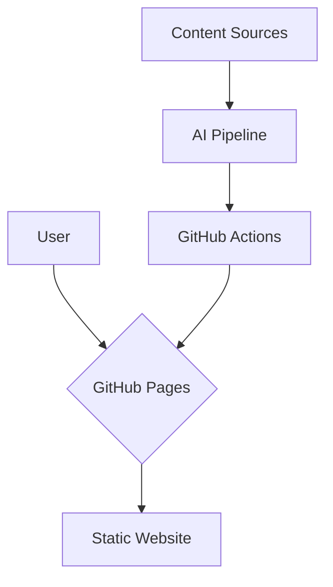
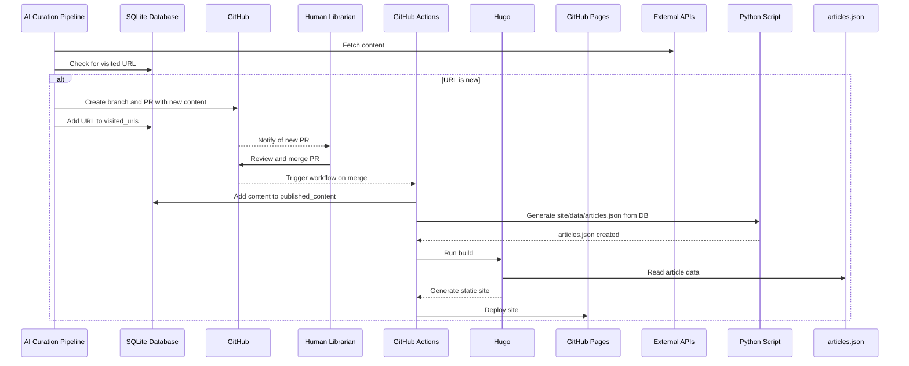
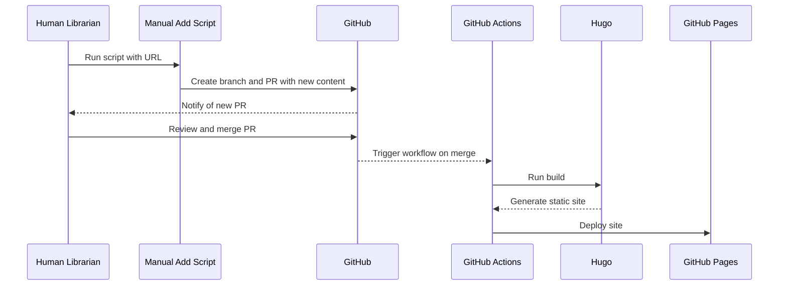

*`This document outlines the technical architecture of the project. It is the 'How' the system will be built.`*

# Quality Share Architecture Document

## 1. Introduction

This document outlines the overall project architecture for Quality Share, including backend systems, shared services, and non-UI specific concerns. Its primary goal is to serve as the guiding architectural blueprint for AI-driven development, ensuring consistency and adherence to chosen patterns and technologies.

## 2. High Level Architecture

### 2.1. Technical Summary

The system employs a static site architecture, utilizing Hugo as the static site generator. The website is hosted on GitHub Pages, with a CI/CD pipeline orchestrated by GitHub Actions. A key feature is an AI-assisted content curation pipeline built with LangChain and Python, running in a containerized environment. The project is structured as a monorepo to maintain cohesion between the website and the pipeline. Google Analytics is used for website analytics.

### 2.2. High Level Overview

*   **Architectural Style:** Static Site Architecture.
*   **Repository Structure:** Monorepo.
*   **Service Architecture:** A single service for the website and a separate service for the AI pipeline.
*   **User Interaction Flow:** Users interact with a static website. The content is curated and updated by an automated AI pipeline.
*   **Key Architectural Decisions:**
    *   **Static Site:** Chosen for performance, security, and cost-effectiveness.
    *   **Hugo:** A fast and flexible static site generator.
    *   **GitHub Pages & Actions:** A seamless, integrated platform for hosting and CI/CD.
    *   **LangChain & Python:** A modular and powerful framework for building the AI pipeline.
    *   **Monorepo:** To simplify atomic changes and provide a unified project view.
    *   **Google Analytics:** For website analytics and user feedback.

### 2.3. High Level Project Diagram



### 2.4. Architectural and Design Patterns

*   **Static Site Generation:** For performance and security.
*   **CI/CD:** For automated builds and deployments.
*   **AI-assisted Content Curation:** To automate content discovery and summarization.
*   **Monorepo:** For code cohesion.

### 2.5. Agile Team Perspective & Limitations

This section captures the key discussion points and limitations identified from the Agile Team Perspective.

*   **QA Perspective:**
    *   **Limitation:** Native GitHub Pages lacks built-in support for per-PR preview deployments, making staging and testing of changes before production more challenging.
    *   **Decision:** For the MVP, we will rely on local development with `hugo server`, automated checks in the CI/CD pipeline (linting, link checking), and manual verification of the live site after deployment. Advanced QA features like PR previews will be considered post-MVP.
*   **Cost Uncertainty:**
    *   **Limitation:** The cost of the AI pipeline is currently unknown and will depend on the chosen LLM provider, the volume of content processed, and the frequency of pipeline runs.
    *   **Decision:** We will implement a cost monitoring strategy and start with a small, controlled budget to establish a baseline.
*   **Analytics & Privacy:**
    *   **Limitation:** The use of Google Analytics introduces a privacy compliance burden.
    *   **Decision:** We will implement a cookie consent banner and GA4 Consent Mode to ensure compliance and build user trust.
*   **Educational Purpose:**
    *   **Decision:** The project's architecture is intentionally designed to showcase the integration of various technologies and the decision-making process behind a modern web application, serving an educational purpose.

## 3. Tech Stack

### 3.1. Cloud Infrastructure

*   **Provider:** GitHub Pages (MVP)
*   **Key Services:** GitHub Actions (MVP)
*   **Deployment Regions:** N/A (GitHub Pages is a global CDN)

### 3.2. Technology Stack Table

| Category          | Technology   | Version    | Purpose                               | Rationale                                       |
| ----------------- | ------------ | ---------- | ------------------------------------- | ----------------------------------------------- |
| **Language**      | `Python`     | `3.12`     | AI Pipeline                           | Latest features and long-term support.          |
|                   | `Go`         | `1.22`     | Static Site Generation (Hugo)         | Stability and reproducibility for Hugo.         |
| **Runtime**       | `Python`     | `3.12`     | Executes AI pipeline code in container| Matches the chosen language version.            |
| **Framework**     | `LangChain`  | `(latest)` | AI Pipeline Orchestration             | Modular and simplifies LLM integration.         |
|                   | `Hugo`       | `0.125.4`  | Static Site Generator                 | Fast, flexible, and well-supported.             |
| **Database**      | `SQLite`     | `(latest)` | AI Pipeline Metadata Storage        | Simple, file-based, and sufficient for MVP.     |
| **Dev Tools**     | `VS Code`    | `(latest)` | Code editing and development        | Powerful, extensible, with AI integrations.     |
|                   | `gemini-cli` | `(latest)` | AI-assisted development             | Provides AI capabilities in the terminal.       |
|                   | `Git`        | `(latest)` | Source code management              | Industry standard for version control.          |
|                   | `Poetry`     | `(latest)` | Python dependency management        | Modern, robust, and simplifies packaging.       |
|                   | `Ruff`       | `(latest)` | Python linting and formatting       | Extremely fast and integrates well with CI/CD.  |
| Dev Tools         | `Pytest`     | `(latest)` | Python testing framework            | Powerful, flexible, and industry standard.      |

## 4. Components

### 4.1. AI Curation Pipeline

*   **Responsibility:** To autonomously discover, process, and propose new content by creating Pull Requests. It can be triggered automatically on a schedule or manually by the librarian for a specific URL. It also tracks visited URLs to prevent duplicates.
*   **Workflow (Automated):**
    1.  Runs on a schedule, fetching content from external sources.
    2.  Checks a `visited_urls` table in the SQLite database to ensure content is new.
    3.  For new content, it creates a new branch and a Markdown file containing the processed content (`title`, `summary`, `tags`, etc.).
    4.  It then automatically opens a Pull Request for human review.
    5.  Finally, it updates the `visited_urls` table to log that the content has been processed.
*   **Technology:** Python, LangChain, Poetry, Git.

### 4.2. Static Site & CI/CD Workflow

*   **Responsibility:** To build and deploy the website automatically when new content is approved, reading article data from `site/data/articles.json`.
*   **Workflow:**
    1.  Is triggered when a content Pull Request is merged into the `main` branch.
    2.  A GitHub Action runs a script to update a `published_content` table in the SQLite database with the content from the newly merged file.
    3.  The GitHub Action then executes Hugo, which builds the static site using the data from `site/data/articles.json`.
    4.  The newly built site is then deployed to GitHub Pages.
*   **Technology:** Hugo, Go, GitHub Actions.

## 5. External APIs

The AI Curation Pipeline will monitor the following sources for new content. The primary method for fetching content is via RSS feeds. For sources without an RSS feed, the pipeline will fall back to web scraping.

| Source                  | URL                                        | Method      | Authentication | Notes                                               |
| ----------------------- | ------------------------------------------ | ----------- | -------------- | --------------------------------------------------- |
| Facebook Engineering    | `https://engineering.fb.com/feed/`         | RSS Feed    | None           |                                                     |
| Netflix Tech Blog       | `http://netflixtechblog.com/feed`          | RSS Feed    | None           |                                                     |
| Uber Engineering        | `https://eng.uber.com/feed/`               | RSS Feed    | None           |                                                     |
| Google Research         | `http://research.googleblog.com/`          | RSS Feed    | None           |                                                     |
| OpenAI Developer Blog   | `https://openai.com/news/rss.xml`          | RSS Feed    | None           |                                                     |
| Anthropic Engineering   | `https://rsshub.app/anthropic/engineering` | RSS Feed    | None           | Unofficial feed via RSSHub.                         |
| Apple Security          | `https://security.apple.com/blog/`         | Web Scraping| None           | No official RSS feed found. Must respect robots.txt.|

## 6. Core Workflows

This sequence diagram illustrates the core content curation and publishing workflow, from discovery to deployment.



### Manual Curation Workflow

This diagram illustrates the workflow when the librarian manually submits a new article.


## 7. Database Schema

Based on our data model and workflow, the following two tables will be created in the SQLite database.

### `visited_urls`

This table acts as a memory for the AI pipeline to prevent processing the same URL twice.

```sql
CREATE TABLE visited_urls (
    url TEXT PRIMARY KEY,
    visited_at DATETIME NOT NULL
);
```

### `published_content`

This table holds the curated content that will be used to build the website.

```sql
CREATE TABLE published_content (
    id TEXT PRIMARY KEY,
    title TEXT NOT NULL,
    url TEXT NOT NULL UNIQUE,
    summary TEXT,
    source_name TEXT,
    content_type TEXT NOT NULL,
    publication_date DATETIME,
    authors TEXT, -- Stored as a JSON array
    doi TEXT,
    tags TEXT -- Stored as a JSON array
);

```

## 8. Source Tree

The project will be organized as a monorepo with a clear separation between the AI Curation Pipeline and the Hugo-based website.

```
.
├── .github/
│   └── workflows/
│       ├── main.yml         # GitHub Actions workflow for building and deploying the site
│       └── pipeline.yml     # GitHub Actions workflow for running the AI Curation Pipeline on a schedule
├── pipeline/
│   ├── poetry.lock        # Poetry lock file for reproducible dependencies
│   ├── pyproject.toml     # Defines project dependencies and metadata for the pipeline
│   └── src/
│       ├── __main__.py      # Main entry point to run the pipeline
│       ├── pipeline.py      # Core logic for content processing and PR creation
│       └── sources.py       # Modules for fetching content from different external APIs/RSS feeds
├── site/
│   ├── archetypes/        # Hugo archetypes
│   ├── content/
│   │   └── posts/         # Where approved content will live after being merged
│   ├── data/              # Data files for Hugo
│   ├── layouts/           # Hugo layout files
│   ├── static/            # Static assets (CSS, JS, images)
│   └── hugo.toml          # Hugo configuration file
└── README.md
```

## 9. Infrastructure and Deployment

This section defines the deployment architecture and practices for the project.

*   **Infrastructure as Code (IaC):** The GitHub Actions workflow files (`.github/workflows/*.yml`) will serve as our IaC, defining the deployment process declaratively.
*   **Deployment Strategy:** A **Continuous Deployment** model will be used. Every merge to the `main` branch will automatically trigger a build and deployment of the website.
*   **CI/CD Platform:** **GitHub Actions**.
*   **Environments:** For the MVP, there will be a single `production` environment, which is the live GitHub Pages site. A `staging` environment has been deferred as a post-MVP enhancement.
*   **Rollback Strategy:** The rollback strategy is to revert the problematic commit in Git. This will trigger a new deployment, effectively rolling back the site to its previous state.

## 10. Error Handling Strategy

This section defines the error handling approach for the project's components.

### AI Curation Pipeline (Python)

*   **General Approach:** The pipeline will use standard Python exceptions and create custom exceptions for pipeline-specific issues (e.g., `ContentProcessingError`).
*   **Logging:** Python's built-in `logging` module will be used to log errors to standard output, which will be captured by the GitHub Actions environment.
*   **Error Handling Patterns:**
    *   **Network Errors:** A retry mechanism with exponential backoff will be implemented to handle transient network issues when fetching content.
    *   **Content Processing Errors:** If an article cannot be processed, the pipeline will log the error and skip the article to ensure the entire process is not halted.
    *   **GitHub API Errors:** If the pipeline fails to create a Pull Request, it will log the error.

### Static Site & CI/CD Workflow (Hugo & GitHub Actions)

*   **General Approach:** The build process is designed to be "fail-fast." If Hugo encounters an error, it will stop the build, preventing a broken site from being deployed. The error will be logged in the GitHub Actions output.

### Post-MVP Enhancements

*   **Proactive Error Notification:** For the MVP, reviewing GitHub Actions logs will be the primary method for identifying skipped articles or pipeline failures. Post-MVP, a more proactive notification system (such as automatically creating GitHub Issues for skipped articles) will be implemented.

## 11. Documentation Strategy

This section defines the documentation strategy for the project.

*   **Project Documentation:** The `docs/` folder will serve as the single source of truth for project-level documentation. Each file will have a clear purpose, as defined by the header note at the top of each file.
*   **Code Documentation:** All Python code, especially public modules and functions, must have docstrings explaining their purpose, arguments, and return values.
*   **Architectural Decision Records (ADRs):** The `site/content/decisions` folder will be used to log all significant architectural decisions. This creates a clear history of *why* certain decisions were made.
*   **README:** The `README.md` file will serve as the main entry point for the project, providing a high-level overview and links to the other documentation.

## 12. Coding Standards

This section defines the coding standards for the project, which are mandatory for all code contributions.

*   **Style & Linting:** We will use **`Black`** for code formatting and **`Ruff`** for linting. All code must pass the linter before being committed, and this will be enforced automatically in the CI/CD pipeline.
*   **Type Hinting:** All function signatures **must** include type hints.
*   **Dependency Management:** All Python dependencies **must** be managed through **`Poetry`**. The `poetry.lock` file will be committed to the repository.
*   **Testing:** All new functionality must be accompanied by tests using the **`Pytest`** framework, with a target of 80% test coverage.
*   **Secrets Management:** No secrets will be hardcoded. They **must** be passed in via GitHub Actions secrets. A secrets scanning tool (e.g., **`gitleaks`**) will be integrated into the CI/CD pipeline to prevent accidental commits of secrets.
*   **PR-Driven Workflow:** All code changes **must** be submitted as Pull Requests and pass all automated checks before being merged.
    *   **Note:** This rule will be strictly enforced *after* the initial project setup and architecture definition are complete. During the bootstrapping phase, direct commits to `main` are permissible.

## 13. Test Strategy

This section defines the testing strategy for the project.

### Testing Philosophy
*   **Approach:** For the MVP, we will use a "test-after" approach, where tests are written after a feature is implemented.
*   **Coverage Goal:** We will target **80% test coverage** for the Python code in the AI Curation Pipeline.

### Test Types
*   **Unit Tests:**
    *   **Framework:** We will use **`Pytest`**.
    *   **Location:** Tests will be located in a `pipeline/tests` directory.
    *   **Details:** These will be small, focused tests that verify the functionality of individual functions and classes. We will use mocking to isolate components and avoid external dependencies like network calls.

*   **Integration Tests:**
    *   **Scope:** We will have a small number of integration tests that verify the interaction between the different modules of the AI pipeline (e.g., does the main pipeline logic correctly call the content source module and then the PR creation module?).

*   **End-to-End (E2E) Tests:**
    *   **Approach:** For the MVP, E2E testing will be a **manual process**. This will involve:
        1.  Manually triggering the AI pipeline.
        2.  Verifying that a Pull Request is correctly created in GitHub.
        3.  Merging the PR and verifying that the website is deployed correctly.

### Continuous Testing
*   **CI Integration:** All automated tests (unit and integration) will be run automatically in our GitHub Actions workflow on every Pull Request. A PR will be blocked from merging if any tests fail.

## 14. Security

This section defines the mandatory security requirements for the project.

### Secrets Management
*   **Rule:** No API keys, tokens, or other secrets will ever be hardcoded in the source code.
*   **Implementation:** All secrets will be stored in **GitHub Actions secrets** and passed to the application as environment variables during runtime.
*   **Tool:** We will use the **`gitleaks`** GitHub Action to automatically scan every commit for accidentally committed secrets. This will block any PR that contains a secret.

### Dependency Security
*   **Rule:** We must regularly scan our project's dependencies for known vulnerabilities.
*   **Tool:** We will enable **GitHub's `Dependabot`**. It will automatically monitor our dependencies and create Pull Requests to update any that have known security vulnerabilities.

### Input Validation
*   **Rule:** All data fetched from external sources (RSS feeds, websites) must be treated as untrusted.
*   **Implementation:** The AI Curation Pipeline will validate the structure and content of the data it fetches before processing it to prevent parsing errors or potential injection attacks.

### Principle of Least Privilege
*   **Rule:** The GitHub token used by our AI pipeline to create Pull Requests will be configured with the minimum permissions required. It will only have permission to create branches and PRs, not to delete the repository or modify other settings.

### CI/CD Security
*   **Rule:** We will rely on GitHub's default security setting that requires manual approval from a project administrator before running workflows on Pull Requests from first-time external contributors. This prevents malicious use of our CI/CD resources.

## 15. Checklist Results

This section contains the results of the architectural validation checklist run against this document.

### Executive Summary

*   **Overall Architecture Readiness:** **High.** The architecture is well-defined, robust, and well-documented for an MVP.
*   **Critical Risks Identified:**
    1.  **Lack of Monitoring:** Over-reliance on manually checking logs for pipeline failures.
    2.  **Data Backup:** No defined strategy for backing up the SQLite database.
    3.  **Accessibility:** Accessibility (a11y) for the frontend was not initially addressed.
*   **Key Strengths:**
    *   Excellent separation of concerns between the `pipeline` and `site`.
    *   The PR-driven workflow is robust, auditable, and leverages GitOps principles.
    *   Strong security posture for an MVP.
*   **Project Type:** Full-stack (Static Site + Data Pipeline).

### Section Analysis

*   **1. Requirements Alignment:** **Pass (80%).**
*   **2. Architecture Fundamentals:** **Pass (95%).**
*   **3. Technical Stack & Decisions:** **Pass (90%).**
*   **4. Frontend Design & Implementation:** **Pass (70%).** Score reflects the simplicity of the static site. The main gap (accessibility) has been addressed.
*   **5. Resilience & Operational Readiness:** **Warning (60%).** The main gap (monitoring) has been addressed with a requirement for email notifications.
*   **6. Security & Compliance:** **Pass (100%).**
*   **7. Implementation Guidance:** **Pass (95%).**
*   **8. Dependency & Integration Management:** **Pass (90%).**
*   **9. AI Agent Implementation Suitability:** **Pass (95%).**
*   **10. Accessibility Implementation:** **Fail (0%).** This has now been addressed by adding a formal requirement for WCAG 2.1 AA compliance.

### Risk Assessment & Mitigations

1.  **Lack of Proactive Monitoring (High Severity):**
    *   **Mitigation:** A requirement has been added to implement email notifications on pipeline failure.
2.  **No Data Backup Strategy (Medium Severity):**
    *   **Mitigation:** A post-MVP requirement to implement a database backup strategy will be added.
3.  **No Accessibility (a11y) Plan (Medium Severity):**
    *   **Mitigation:** A requirement for WCAG 2.1 AA compliance has been added. We will use the accessibility-compliant Ananke theme.

### Recommendations

*   **Must-Fix Before Development:** All must-fix items have been addressed by adding them as formal requirements.
*   **Should-Fix for Better Quality:** A database backup strategy should be implemented post-MVP.
```

