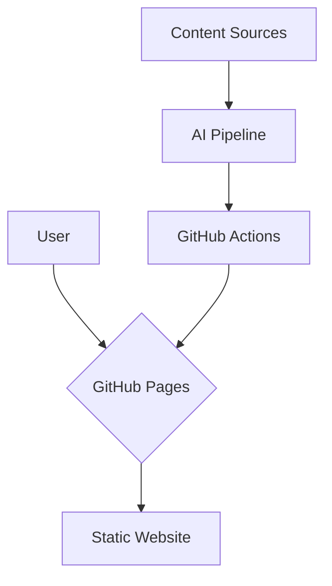

# Quality Share Architecture Document

## 1. Introduction

This document outlines the overall project architecture for Quality Share, including backend systems, shared services, and non-UI specific concerns. Its primary goal is to serve as the guiding architectural blueprint for AI-driven development, ensuring consistency and adherence to chosen patterns and technologies.

## 2. High Level Architecture

### 2.1. Technical Summary

The system employs a static site architecture, utilizing Hugo as the static site generator. The website is hosted on GitHub Pages, with a CI/CD pipeline orchestrated by GitHub Actions. A key feature is an AI-assisted content curation pipeline built with LangChain and Python, running in a containerized environment. The project is structured as a monorepo to maintain cohesion between the website and the pipeline. Google Analytics is used for website analytics.

### 2.2. High Level Overview

*   **Architectural Style:** Static Site Architecture.
*   **Repository Structure:** Monorepo.
*   **Service Architecture:** A single service for the website and a separate service for the AI pipeline.
*   **User Interaction Flow:** Users interact with a static website. The content is curated and updated by an automated AI pipeline.
*   **Key Architectural Decisions:**
    *   **Static Site:** Chosen for performance, security, and cost-effectiveness.
    *   **Hugo:** A fast and flexible static site generator.
    *   **GitHub Pages & Actions:** A seamless, integrated platform for hosting and CI/CD.
    *   **LangChain & Python:** A modular and powerful framework for building the AI pipeline.
    *   **Monorepo:** To simplify atomic changes and provide a unified project view.
    *   **Google Analytics:** For website analytics and user feedback.

### 2.3. High Level Project Diagram

### 2.4. Architectural and Design Patterns

*   **Static Site Generation:** For performance and security.
*   **CI/CD:** For automated builds and deployments.
*   **AI-assisted Content Curation:** To automate content discovery and summarization.
*   **Monorepo:** For code cohesion.

### 2.5. Agile Team Perspective & Limitations

This section captures the key discussion points and limitations identified from the Agile Team Perspective.

*   **QA Perspective:**
    *   **Limitation:** Native GitHub Pages lacks built-in support for per-PR preview deployments, making staging and testing of changes before production more challenging.
    *   **Decision:** For the MVP, we will rely on local development with `hugo server`, automated checks in the CI/CD pipeline (linting, link checking), and manual verification of the live site after deployment. Advanced QA features like PR previews will be considered post-MVP.
*   **Cost Uncertainty:**
    *   **Limitation:** The cost of the AI pipeline is currently unknown and will depend on the chosen LLM provider, the volume of content processed, and the frequency of pipeline runs.
    *   **Decision:** We will implement a cost monitoring strategy and start with a small, controlled budget to establish a baseline.
*   **Analytics & Privacy:**
    *   **Limitation:** The use of Google Analytics introduces a privacy compliance burden.
    *   **Decision:** We will implement a cookie consent banner and GA4 Consent Mode to ensure compliance and build user trust.
*   **Educational Purpose:**
    *   **Decision:** The project's architecture is intentionally designed to showcase the integration of various technologies and the decision-making process behind a modern web application, serving an educational purpose.

## 3. Tech Stack

### 3.1. Cloud Infrastructure

*   **Provider:** GitHub Pages (MVP)
*   **Key Services:** GitHub Actions (MVP)
*   **Deployment Regions:** N/A (GitHub Pages is a global CDN)

### 3.2. Technology Stack Table

| Category          | Technology   | Version    | Purpose                               | Rationale                                       |
| ----------------- | ------------ | ---------- | ------------------------------------- | ----------------------------------------------- |
| **Language**      | `Python`     | `3.12`     | AI Pipeline                           | Latest features and long-term support.          |
|                   | `Go`         | `1.22`     | Static Site Generation (Hugo)         | Stability and reproducibility for Hugo.         |
| **Runtime**       | `Python`     | `3.12`     | Executes AI pipeline code in container| Matches the chosen language version.            |
| **Framework**     | `LangChain`  | `(latest)` | AI Pipeline Orchestration             | Modular and simplifies LLM integration.         |
|                   | `Hugo`       | `0.125.4`  | Static Site Generator                 | Fast, flexible, and well-supported.             |
| **Database**      | `SQLite`     | `(latest)` | AI Pipeline Metadata Storage        | Simple, file-based, and sufficient for MVP.     |
| **Dev Tools**     | `VS Code`    | `(latest)` | Code editing and development        | Powerful, extensible, with AI integrations.     |
|                   | `gemini-cli` | `(latest)` | AI-assisted development             | Provides AI capabilities in the terminal.       |
|                   | `Git`        | `(latest)` | Source code management              | Industry standard for version control.          |
|                   | `Poetry`     | `(latest)` | Python dependency management        | Modern, robust, and simplifies packaging.       |
|                   | `Ruff`       | `(latest)` | Python linting and formatting       | Extremely fast and integrates well with CI/CD.  |
| Dev Tools         | `Pytest`     | `(latest)` | Python testing framework            | Powerful, flexible, and industry standard.      |

## 4. Components

### 4.1. AI Curation Pipeline

*   **Responsibility:** To autonomously discover, process, and propose new content by creating Pull Requests. It also tracks visited URLs to prevent duplicate submissions.
*   **Workflow:**
    1.  Runs on a schedule, fetching content from external sources.
    2.  Checks a `visited_urls` table in the SQLite database to ensure content is new.
    3.  For new content, it creates a new branch and a Markdown file containing the processed content (`title`, `summary`, `tags`, etc.).
    4.  It then automatically opens a Pull Request for human review.
    5.  Finally, it updates the `visited_urls` table to log that the content has been processed.
*   **Technology:** Python, LangChain, Poetry, Git.

### 4.2. Static Site & CI/CD Workflow

*   **Responsibility:** To build and deploy the website automatically when new content is approved.
*   **Workflow:**
    1.  Is triggered when a content Pull Request is merged into the `main` branch.
    2.  A GitHub Action runs a script to update a `published_content` table in the SQLite database with the content from the newly merged file.
    3.  The GitHub Action then executes Hugo, which builds the static site using the data from the `published_content` table.
    4.  The newly built site is then deployed to GitHub Pages.
*   **Technology:** Hugo, Go, GitHub Actions.

